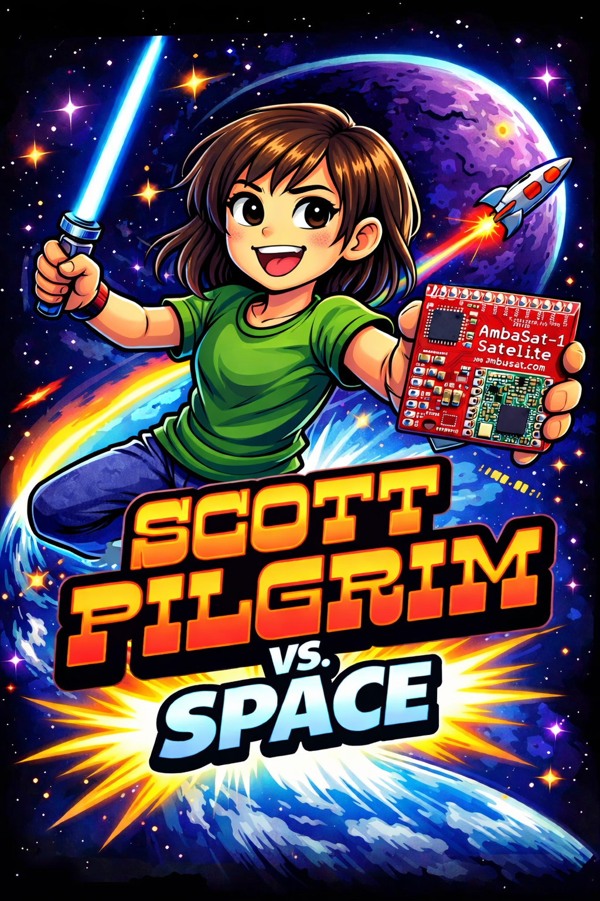
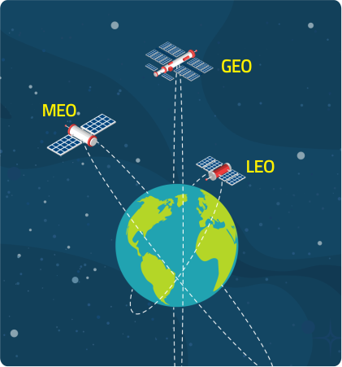
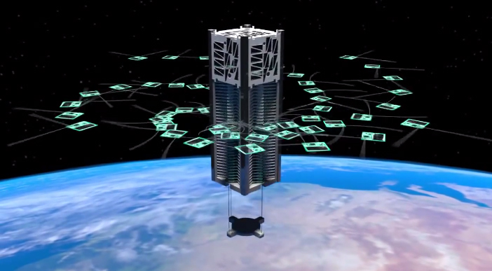
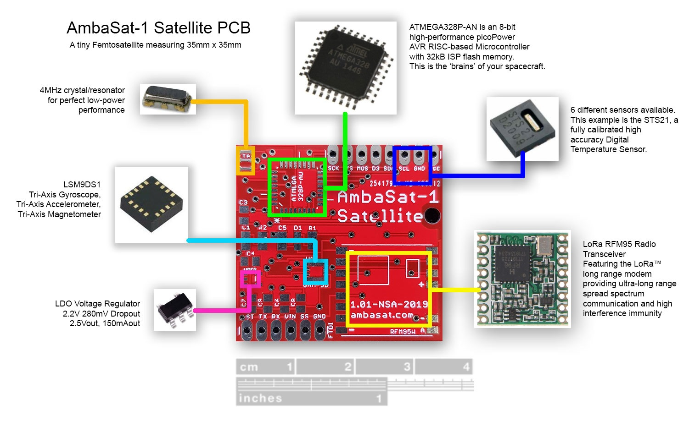
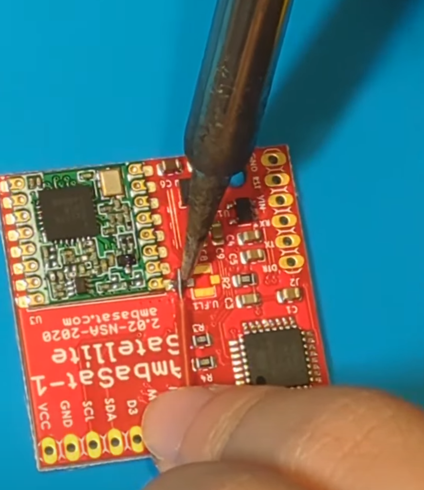
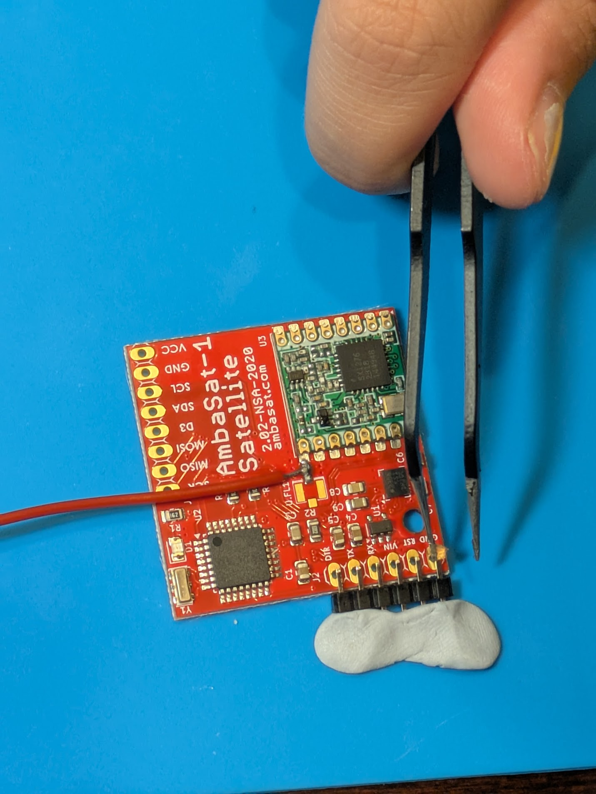
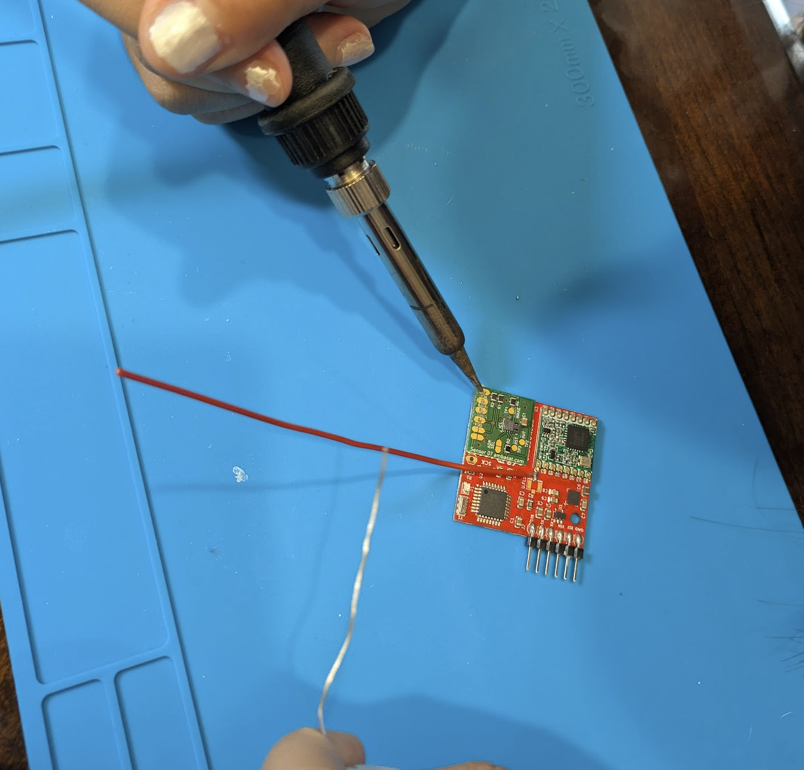
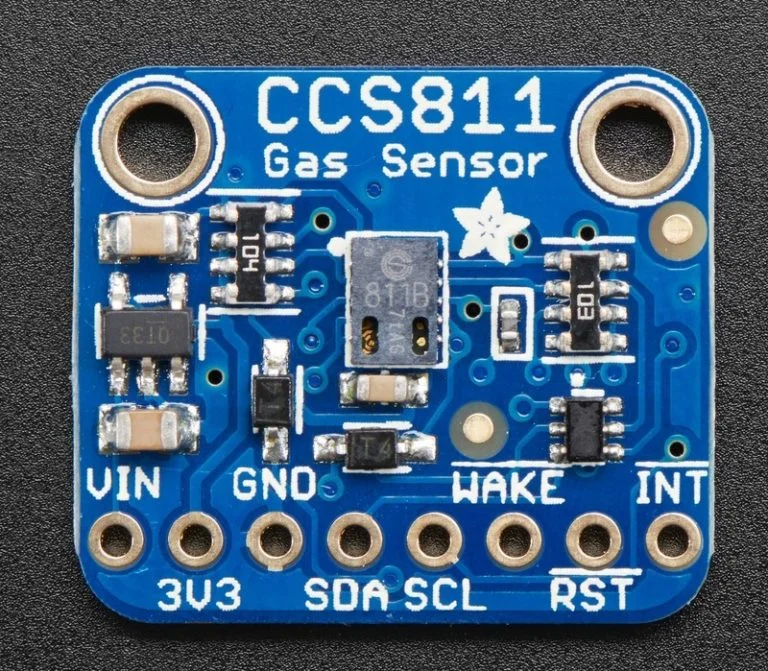
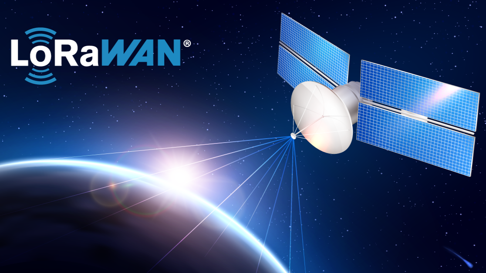
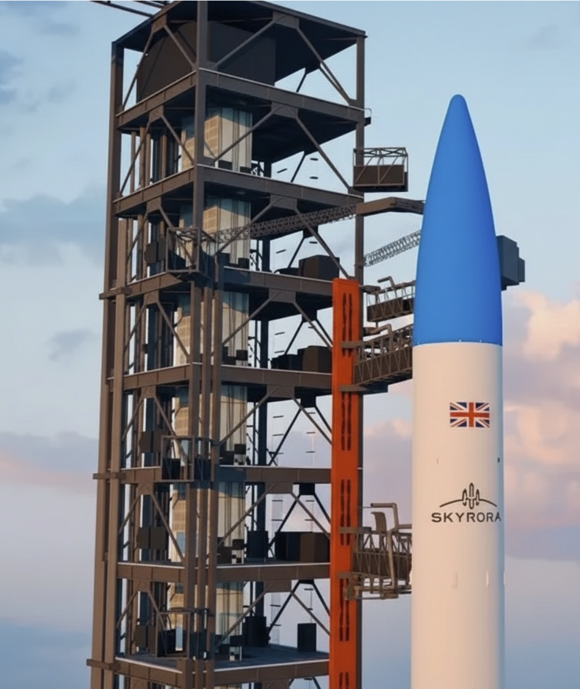

# Scott Pilgrim vs. Space: A Greenhouse Gas–Detecting Satellite

*Scott Pilgrim vs. the World* is a widely popular movie about a man named Scott Pilgrim who, through unconventional means, fights for the love of a girl named Ramona by defeating her seven evil exes. Similarly, the **Scott Pilgrim vs. Space** project addresses climate change through unconventional means: by launching a satellite into space to detect and monitor greenhouse gases in the atmosphere.

Greenhouse gases, according to the United States Environmental Protection Agency, consist of carbon dioxide, methane, nitrous oxide, and fluorinated gases. These gases remain in the atmosphere for a wide range of time, from just a few years to thousands of years. With the growing abundance of these gases in the atmosphere, the Center for Climate and Energy Solutions states that “industrial processes and land use changes have significantly increased the total volume of greenhouse gases—leading to a more than 1 degree C (2 degrees F) increase in average global temperature since the pre-industrial era.”

## Orbit Selection and Satellite Type

Scott Pilgrim vs. Space is a **low-Earth orbit (LEO) satellite**, defined as a spacecraft that orbits the Earth at an altitude between 160 and 1,000 kilometers, according to the European Space Agency. LEO satellites orbit very close to Earth and move quickly across the sky. Because they are so close, they can collect high-resolution data and communicate with low latency. Common examples of LEO satellites include the International Space Station and satellites used for Earth imaging.

Other orbit options include **MEO** and **GEO**. MEO satellites fly at a middle altitude, offering a balance between coverage area and signal delay, while GEO satellites orbit at the same rate Earth rotates, making them appear fixed over one spot on the planet. However, since both MEO and GEO satellites operate far outside Earth’s atmosphere, a greenhouse gas sensor would not work effectively in these orbits. This is why low-Earth orbit is the best choice. The illustration below shows the differences between **LEO, MEO, and GEO**.

The Scott Pilgrim vs. Space satellite is classified as a **Sprite satellite**. According to Space Systems Design Studio, Sprite stands for *Supernova Remnants and Proxies for Reionization Testbed Experiment*. Sprite satellites are designed to accomplish specific objectives, such as data collection or communication, while remaining accessible and affordable. Their small size and low cost allow them to be launched in bulk, increasing participation and collaboration in space exploration. Here is an illustration of how tiny sprite satellites launched from CubeSat

## Satellite Platform and Assembly

To build the Scott Pilgrim vs. Space satellite, I used the **AmbaSat-1 Femto Satellite**, which is equipped with a gyroscope, radio communications, and multiple sensors packed into a compact 35 × 35 mm computer. On the board, the AmbaSat-1 features a 4 Hz crystal resonator for low-power performance, a tri-axis gyroscope, accelerometer, and magnetometer, a low-dropout (LDO) voltage regulator, an ATMEGA328P-AN 8-bit high-performance microcontroller, six different sensors, and the LoRa RFM95 transceiver, which I will describe in more detail later.

Assembly began with welding an antenna to the board, which was then cut to fit based on the country of operation. For the United States, a length of 91.5 mm is optimal due to the 915 MHz base frequency. Next, a multimeter was used to verify the flow of energy through the board to ensure stable connections and to prevent short-circuiting. To program the hardware, a set of programming pins was welded to the board and connected to wires that interface with a computer. Finally, a daughterboard sensor—specifically a greenhouse gas sensor—was welded to the back of the board.

## Greenhouse Gas Detection and Sensor Communication

The greenhouse gas sensor selected for this project is the **CCS811 sensor**, described as an “Ultra-Low Power Digital Gas Sensor for Monitoring Indoor Air Quality.” This sensor features AMS micro-hotplate technology, which enables fast cycle times while maintaining low power consumption. It also utilizes an I²C digital interface, simplifying both the hardware and software design.

In addition, the sensor includes intelligent algorithms that support raw measurements to estimate CO₂ levels. Its design is centered on reliability and high-volume applications, with an operational lifespan of at least five years.

The **I²C bus** is a reliable and efficient communication system that links a “master” device with multiple “slave” devices. When the master sends a “start” signal, the SDA line transitions from high to low while the SCL line remains high. The reverse transition signals a “stop” condition, and data transfer occurs between these two signals. Data is transmitted through registers stored in the slave devices, allowing information to be sent to or retrieved from the sensors as needed.

## Communication Systems and Data Transmission

The wireless communication system used in the Scott Pilgrim vs. Space satellite is **LoRa modulation**. As described by The Things Network, LoRa is a “wireless modulation technique derived from Chirp Spread Spectrum (CSS) technology,” using chirp-like signals similar to how bats and dolphins communicate. This allows communication over extremely long distances, making it ideal for satellites transmitting small amounts of data with limited power.

LoRa offers several advantages, including low cost, high capacity, strong indoor coverage, and geolocation without the need for GPS. The LoRa modulation works alongside **LoRaWAN software**, which is built on top of the LoRa protocol.

The software system used to receive messages from the LoRa hardware and LoRaWAN software is **The Things Network (TTN)**. TTN supports applications such as asset tracking, smart irrigation, building management, and environmental monitoring. By using the LoRaWAN network server, TTN securely manages applications, end devices, and gateways, making it well-suited for Internet of Things (IoT) applications in space.

## Programming and Software Design

To program the satellite, I used the **Visual Studio Code**, along with the option of the Arduino IDE. The PlatformIO extension was added to support embedded systems development. The programming language used for the satellite is **C++**.

The software for the Scott Pilgrim vs. Space satellite is set up in layers so each part has a clear job. This makes the system easier to understand, easier to fix when something goes wrong, and much more reliable overall—which was especially important given the satellite’s limited power and short communication windows.

**Main Control Loop: **At the top level, the software follows a straightforward embedded pattern: everything gets set up once, and then the program runs the same main loop over and over. During startup, it initializes the sensors, communication system, and basic hardware checks. Once the satellite is running, the loop continuously reads data, prepares it for transmission, and sends it back to Earth. Keeping this flow simple was a deliberate choice, since it helped keep the system predictable and avoid unexpected behavior in orbit.

**Sensor Handling: **This part of the software talks directly to the onboard sensors, including the CCS811 greenhouse gas sensor. It handles I²C communication, checks when new data is ready, and pulls sensor readings at the right time. By keeping all sensor-related code in one place, it’s easier to adjust settings or add new sensors later and, in practice, it also made debugging much easier.

**Data Packaging: **Raw sensor readings aren’t sent directly. Instead, the software processes the data, scales it to useful values, and packs it into a small payload. Since satellites have very limited bandwidth, this step focuses on sending only the most important information in the smallest format possible, which forced me to be selective about what data actually mattered.

**Communication: **The communication layer handles sending data from space back to Earth using LoRaWAN. It manages network setup, transmission timing, and radio events. Separating this from the rest of the code helps make sure that temporary communication issues don’t interfere with sensor readings or system stability, which kept small radio issues from affecting the entire system.

**Status Checks and Error Handling: **To keep track of how everything is working, the software uses simple indicators like LED signals and debug messages. These make it easier to tell whether sensors and communication links are operating correctly. Instead of stopping when something goes wrong, the system is designed to keep running and report issues whenever possible, which is important when the satellite can’t be manually reset.

**Power and Timing: **Because power is limited, the software controls how often the satellite collects and sends data. By spacing out operations and minimizing active time, this helps extend the satellite’s lifetime while still allowing it to gather useful data, something that became more important as I tested and refined the system.

## **Launch and Mission Plan**

Developed by the Georgia Institute of Technology, the “things” in IoT refer to a collection of newly developed CubeSats designed to transfer information via land, air, and space. According to IoT Marketing, the IoT service is built for flexibility, offering “multi-band connectivity to enable a wide range of geostationary and near-geostationary endpoints, including terrestrial, below-ground, and underwater locations.”

Through the use of CubeSats, the Scott Pilgrim vs. Space satellite will be launched into orbit at an altitude of approximately 300–500 km above Earth’s surface. The selected launch vehicle is the **Skyrora XL three-stage rocket**. During the mission, radio signals will be transmitted using LoRaWAN through The Things Network. The satellite will remain in orbit for about one month, gathering and sending data before re-entering Earth’s atmosphere, where it will burn up with little to no environmental impact.